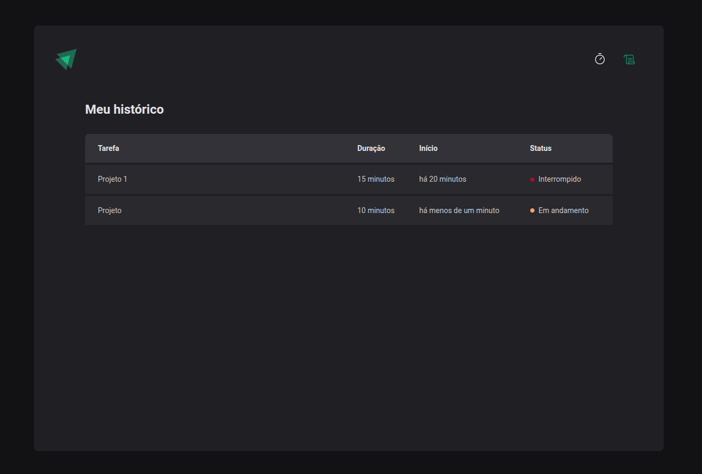

# **Ignite Timer**

Este projeto foi desenvolvido durante o curso **Ignite** da **Rocketseat**, com o objetivo de criar uma aplicação **Pomodoro** que permite iniciar, interromper ciclos e visualizar um histórico de ciclos. A aplicação é totalmente **responsiva**.

---

## 🚀 **Tecnologias Usadas**

- **React**: Biblioteca JavaScript para construção de interfaces de usuário.
- **TypeScript**: Para garantir a tipagem e maior segurança no desenvolvimento.
- **Styled-Components**: Biblioteca para estilização dinâmica e componetizada.
- **Vite**: Ferramenta de build e desenvolvimento rápido.

---

## ⚙️ **Funcionalidades**

- **Iniciar um novo ciclo**: Configure o tempo e inicie o contador.
- **Interromper ciclos em andamento**: Permite pausar ciclos ativos antes de serem concluídos.
- **Histórico de ciclos**: Visualize ciclos concluídos, interrompidos e em andamento.
- **Responsividade completa**: Layout ajustado para diferentes tamanhos de tela.

---

## 🎯 **Objetivos**

- Praticar o uso de **estados** e **reducers** no React.
- Trabalhar com **context API** para gerenciamento global de estados.
- Aplicar **hooks personalizados** para lógica reutilizável.
- Explorar **Styled-Components** para estilização dinâmica.

---

## 🖼 **Layout do Projeto**

### Tela Inicial:

### Histórico de Ciclos:

