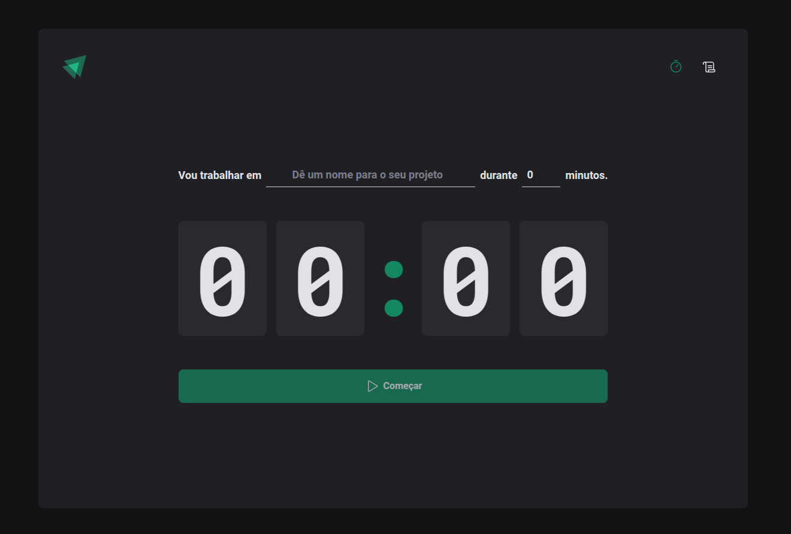

Ignite Timer React
O Ignite Timer é um aplicativo desenvolvido durante o curso Ignite da Rocketseat, com o objetivo de criar uma aplicação funcional de Pomodoro. O projeto foi construído utilizando React e TypeScript, explorando conceitos avançados como reducers, Context API e componentização. A aplicação oferece controle total sobre os ciclos de trabalho, permitindo criar, interromper e visualizar ciclos em andamento ou concluídos.

🚀 Tecnologias Usadas
React: Biblioteca JavaScript para construção de interfaces de usuário modernas.
Vite: Ferramenta de build e desenvolvimento ágil.
TypeScript: Para tipagem estática e segurança no desenvolvimento.
Styled-Components: Para estilização dinâmica e modularizada.
React Router DOM: Gerenciamento de rotas e navegação.

⚙️ Funcionalidades
Iniciar um novo ciclo: Crie um ciclo de trabalho configurando a tarefa e a duração.
Interromper ciclo em andamento: Pausa o ciclo atual e registra no histórico.
Visualizar ciclos em andamento: Acompanhe o progresso do ciclo ativo.
Histórico de ciclos: Consulte todos os ciclos concluídos ou interrompidos.
Responsividade total: Design adaptado para diferentes dispositivos.

🎯 Objetivos do Projeto
Praticar o uso de Context API e reducers para gerenciamento global de estado.
Compreender e aplicar conceitos de imutabilidade do estado no React.
Criar componentes reutilizáveis e aplicar boas práticas de desenvolvimento.
Implementar rotas e navegação em uma aplicação React.

🖼 Layout do Projeto

